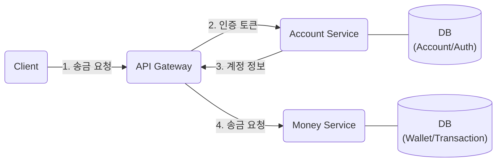
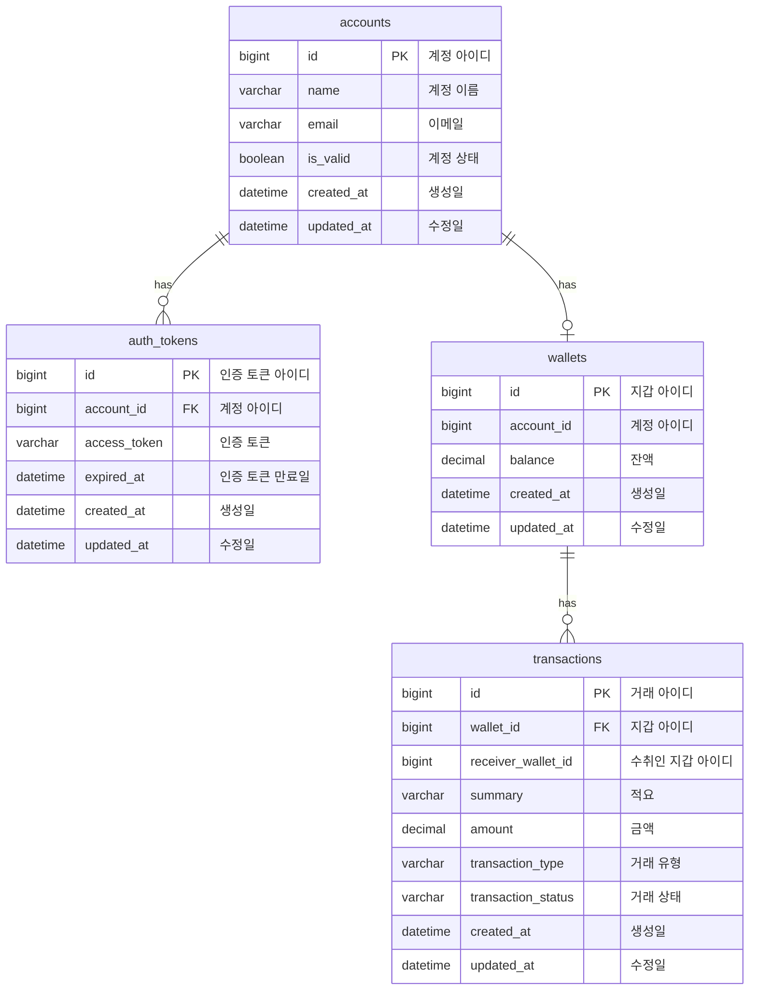

# my-pay
MSA로 구현한 송금 서비스로 REST API를 제공합니다.  
api-gateway, account-service, money-service로 이루어져 있으며, 각 서비스는 독립적으로 작동합니다.

## 목표
- [ ] API 설계
- [ ] DB 설계
- [ ] 서비스 확장에 필요한 고민과 경험
- [ ] 성능 개선을 위한 모니터링 및 부하 테스트 경험
- [ ] 블로그 글 작성

## 진행 방식
1. 작업할 내용을 이슈로 등록합니다.
2. develop 브랜치에서 feature 브랜치를 생성하여 작업을 진행합니다.
3. 작업이 완료되면 PR을 통해 리뷰어와 코드 리뷰를 진행합니다.
4. 리뷰 내용을 반영하고 리뷰어의 승인을 받으면 develop 브랜치로 머지를 수행합니다.
5. 머지가 완료되면 이슈를 닫습니다.
6. 이 과정을 프로젝트가 완료될 때까지 반복합니다.

## 사용 기술
- Java 17
- Gradle
- Spring Boot 3
- Spring Cloud Gateway
- JPA
- MySQL
- Redis

## 구조

## ERD

## API 문서
[Spring REST Docs](https://spring.io/projects/spring-restdocs)로 만든 API 문서입니다.

Account Service: [account-service/src/main/resources/static/docs/index.html](./account-service/src/main/resources/static/docs/index.html)  
Money Service: [money-service/src/main/resources/static/docs/index.html](./money-service/src/main/resources/static/docs/index.html)
