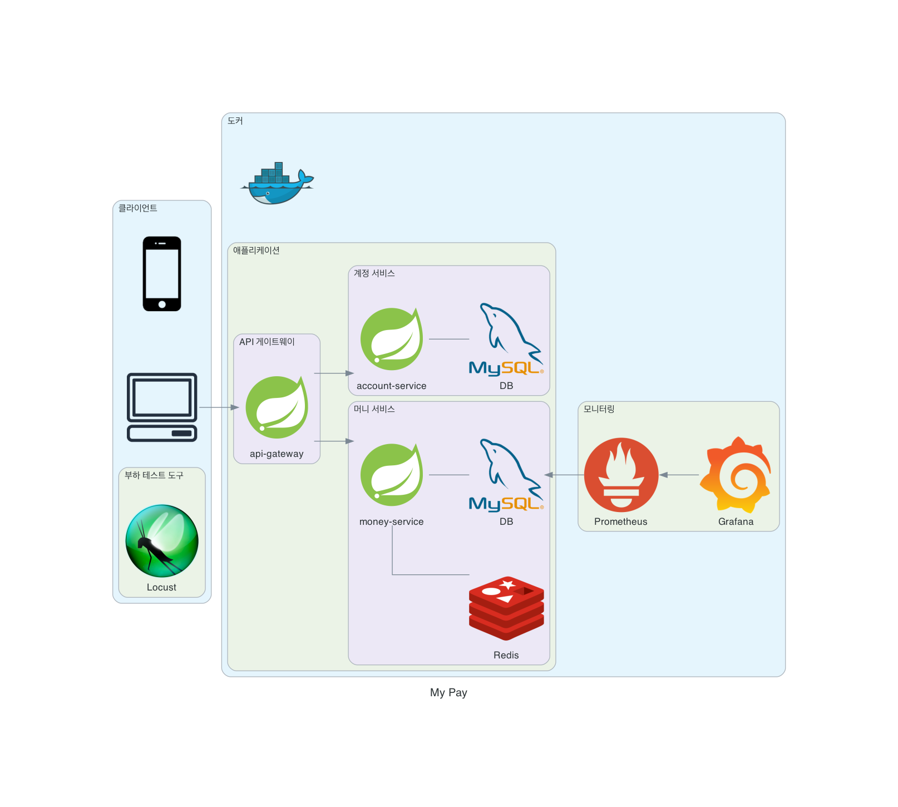
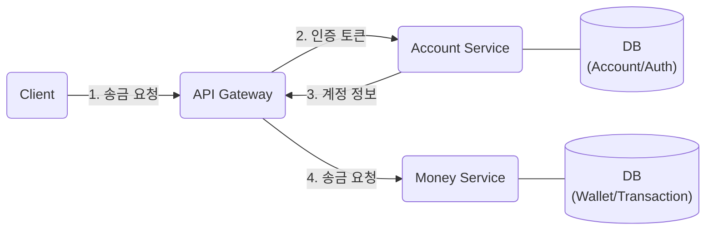
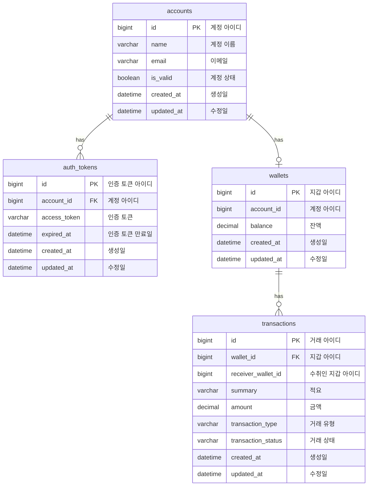

# my-pay
MSA로 설계한 송금 서비스로 REST API를 제공합니다.


- 애플리케이션은 API 게이트웨이와 두 개의 아주 작은 서비스(계정 서비스, 머니 서비스)로 이루어져 있습니다.
- 머니 서비스는 동시성 문제를 분산 락으로 해결하기 위해 Redis와 연동되어 있습니다.
- 애플리케이션을 모니터링하기 위해 Prometheus로 지표를 수집하고 Grafana로 시각화하여 조회할 수 있습니다.
- 여러 개의 애플리케이션이 각각 독립된 환경에서 실행될 수 있도록 도커를 사용하고, 전체 시스템을 명령어 한 번으로 실행하기 위해 도커 컴포즈를 사용했습니다.
- 부하 테스트를 위한 도구는 Locust를 사용했습니다.

## 시작 배경
프로젝트를 시작하기 전에 쏘카 기술 블로그에서 대규모 트래픽에 대응한 서비스 개선 과정을 다룬 글을 읽게 되었습니다.  
서비스를 지속적으로 개선하기 위해 목표를 설정하고, 문제가 되는 상황들을 인식해서 하나씩 해결해 나가는 과정이 너무 인상 깊었습니다.

> [쏘카의 대규모 인증토큰 트래픽 대응 : 개발기](https://tech.socarcorp.kr/dev/2023/06/27/handling-authentication-token-traffic-01.html)

이 글을 읽고 서비스 개선 경험을 쌓을 수 있는 사이드 프로젝트를 하고 싶다는 생각을 하게 되었습니다.  
서비스 개선 경험을 위해 모니터링이 가능하고 변경과 확장이 쉬운 구조로 구축하는 것을 목표로 했습니다.

## 목표
- [X] API 설계
- [X] DB 설계
- [X] 서비스 확장에 필요한 고민과 경험
- [ ] 성능 개선을 위한 모니터링 및 부하 테스트 경험
- [X] 블로그 글 작성

## 진행 방식
1. 작업할 내용을 이슈로 등록합니다.
2. develop 브랜치에서 feature 브랜치를 생성하여 작업을 진행합니다.
3. 작업이 완료되면 PR을 통해 리뷰어와 코드 리뷰를 진행합니다.
4. 리뷰 내용을 반영하고 리뷰어의 승인을 받으면 develop 브랜치로 머지를 수행합니다.
5. 머지가 완료되면 이슈를 닫습니다.
6. 이 과정을 프로젝트가 완료될 때까지 반복합니다.

## 진행 과정
프로젝트 진행 과정에서 고민하고 적용한 내용들을 블로그에 정리합니다.

> [Microservice 환경에서의 아키텍처와 프로젝트 구성](https://ieunji2.tistory.com/4)  
[API Gateway의 개념과 사이드 프로젝트 도입 사례](https://ieunji2.tistory.com/5)

## 사용 기술
- Java 17
- Gradle
- Spring Boot 3
- Spring REST Docs
- Spring Cloud Gateway
- JPA
- MySQL
- Redis
- Prometheus
- Grafana
- Docker
- Locust

## 요청 흐름


## ERD


## 애플리케이션 실행
```
docker-compose up -d
```

## 애플리케이션 종료
```
docker-compose down -v
```

## API 문서
[Spring REST Docs](https://spring.io/projects/spring-restdocs)로 만든 API 문서입니다.

- 계정 서비스: [http://localhost:8080/accounts/docs/index.html](http://localhost:8080/accounts/docs/index.html)
- 머니 서비스: [http://localhost:8080/money/docs/index.html](http://localhost:8080/money/docs/index.html)